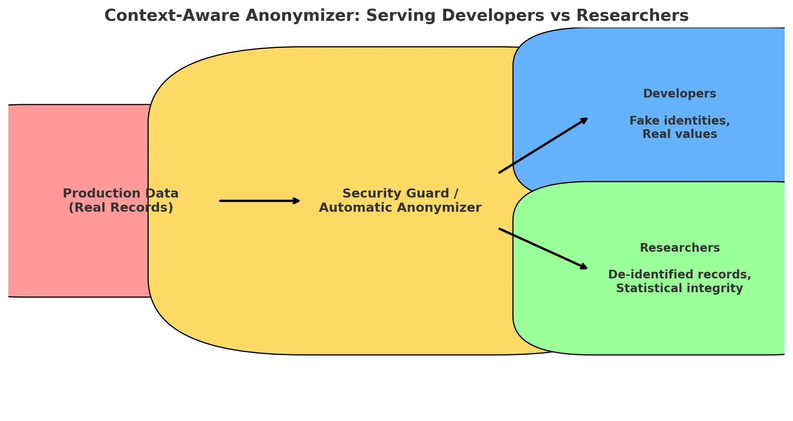

# InnoGuard – The Smart Security Guard for Sensitive Data  

## Problem Statement  
Developers, data scientists, and researchers often need access to realistic datasets for building, testing, and analysis. Using raw production data that contains personally identifiable information (PII) or sensitive details (e.g., patient records) introduces **serious privacy, security, and compliance risks** under regulations like GDPR and CCPA.  

**The challenge:** How to provide data that is **useful, accurate, and representative** while also **protecting sensitive information and preventing data breaches**.  

InnoGuard solves this by acting as a **privacy-preserving data guardrail** for safe, compliant development and research.  

---

## System Architecture 


Here’s the diagram showing the **“security guard / automatic anonymizer”** in the middle:

- **Production Data** flows into the anonymizer.
- For **Developers** → it outputs **fake identities + real values** (useful for testing).
- For **Researchers** → it outputs **de-identified records with statistical integrity** (useful for analytics).
---

## Requirements

- **Frontend**: Node.js ≥ 18, npm or yarn

- **Backend**: Python ≥ 3.10, FastAPI, Uvicorn

---

## Project Structure  

```
/frontend     # Next.js app
/backend      # FastAPI app
README.md
```
- **Frontend:** Next.js (TypeScript + Tailwind + ESLint)  
- **Backend:** FastAPI (Python)  
---

## Getting Started  

### 1. Frontend – Next.js  

**Step 1: Scaffold the project**  
```bash
npx create-next-app@latest frontend --typescript --tailwind --eslint
cd frontend
```

**Step 2: Run the frontend locally**  
```bash
npm run dev
```
The app will be available at [http://localhost:3000](http://localhost:3000).  

---

### 2. Backend – FastAPI  

**Step 1: Create virtual environment & install dependencies**  
```bash
cd backend

python -m venv venv

source venv/bin/activate   # On Windows: venv\Scripts\activate

pip install -r requirements.txt
```

**Step 2: Run FastAPI server**  
```bash
uvicorn main:app --reload
```
Backend will be available at [http://localhost:8000](http://localhost:8000).  

---

## Deployment (Optional)

### Frontend Deployment

- Vercel
 (creators of Next.js) → zero-config deploys, CI/CD built in, free tier.

- Netlify
 → also a great option, supports serverless functions, free tier.

Both are open-source friendly and free to start.

---

### Backend Deployment (FastAPI)

- Open-source / self-hosted options:

     - Dokku
 – like a mini-Heroku you can run on your own VPS.

    - CapRover
 – free, open-source PaaS that runs on any server. Deploy with git push.

    - Coolify
 – modern, self-hosted PaaS (Docker-based, open-source).

- Cloud providers (managed but with free tiers):

    - AWS/GCP/Azure → more setup, but scale-ready. You’d typically use:

    - AWS → ECS (with Fargate) or Elastic Beanstalk

    - GCP → Cloud Run (works beautifully with Docker images)

    -  Azure → App Service or Container Apps

---