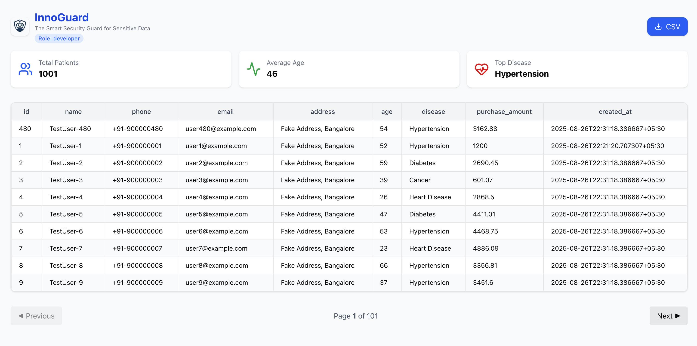

# InnoGuard – Patient Data Dashboard

InnoGuard is a **Next.js application** designed as a secure interface for handling sensitive patient data. It provides **role-based login**, **data visualization**, and **CSV export** functionality.  

This project demonstrates a modern, client-side rendered app with authentication, protected routes, and interactive dashboards.

---

## Features

- **Role-based Login**  
  Choose between **Doctor**, **Developer**, or **Researcher** roles.  
  Authentication is handled via an API call to `/token`.

- **Patient Dashboard** (`/patients`)  
  - Fetches paginated patient data from an API.  
  - Displays real-time statistics:  
    - Total Patients  
    - Average Age  
    - Most Common Disease  
  - Interactive table with pagination.  
  - **Download CSV** export of patient data.

- **Modern UI**  
  Built with **TailwindCSS**, **Radix UI tooltips**, and **lucide-react icons**.

---

## Project Structure

```
frontend/
├── public
│   └── logo.png
├── src
│   ├── app
│   │   ├── favicon.ico
│   │   ├── globals.css
│   │   ├── layout.tsx
│   │   ├── page.tsx
│   │   └── patients
│   │       └── page.tsx
│   └── lib
│       └── utils.ts
├── components.json
├── eslint.config.mjs
├── next-env.d.ts
├── next.config.ts
├── package.json
├── postcss.config.mjs
├── README.md
└── tsconfig.json
```

---

## Tech Stack

- [Next.js 13+ (App Router)](https://nextjs.org/)  
- [React](https://react.dev/)  
- [TailwindCSS](https://tailwindcss.com/)  
- [Radix UI](https://www.radix-ui.com/) (Tooltips)  
- [Lucide Icons](https://lucide.dev/)  

---

## Setup & Installation

1. **Clone the repo**
   ```bash
   git clone https://github.com/your-username/innoguard.git
   cd innoguard
   ```

2. **Install dependencies**
   ```bash
   npm install
   # or
   yarn install
   ```

3. **Configure Environment**
   Create a `.env.local` file in the root:
   ```env
   NEXT_PUBLIC_API_URL=http://localhost:8000
   ```

4. **Run the development server**
   ```bash
   npm run dev
   # or
   yarn dev
   ```

   Navigate to [http://localhost:3000](http://localhost:3000).

---

## Usage

### 1. Login (`/`)
- Select a role (Doctor, Developer, Researcher).  
- Click **Continue** → retrieves an access token and stores it in `localStorage`.  
- Redirects to `/patients`.

### 2. Patient Dashboard (`/patients`)
- Fetches and displays patient records in a table.  
- View real-time stats at the top.  
- Paginate through results.  
- Export data as **patients.csv**.

---

## 📸 Screenshots (Optional)
- Login page with role selection  


- Dashboard with patient stats and table  


---

## Security Notes
- Tokens are stored in `localStorage` for simplicity (replace with HttpOnly cookies in production).  
- Role-based access is enforced by the API; the frontend only surfaces the role.  
- Ensure HTTPS in production for secure transmission.

---

## License
This project is licensed under the MIT License.

---